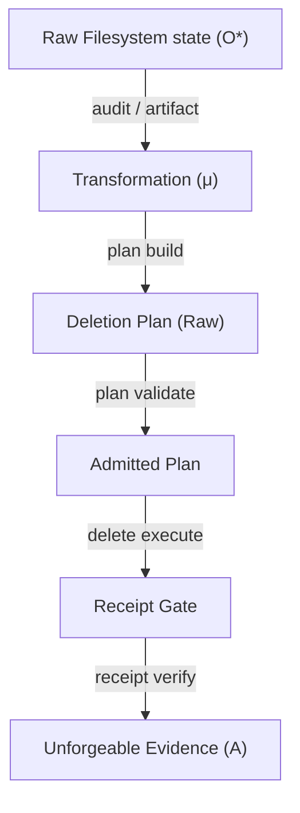

# Unified Fabric Alignment: The Mathematics of Pentecost

This document establishes the formal alignment between the **Chatman Fabric Vision 2030**, Sean Chatman's seminal thesis on **"Manufactured Semantics"**, and the concrete Rust implementation of `osx-clnr` (internally codenamed **Pentecost**). It maps the chaotic substrate of local filesystems to the high-order semantic ontology of the **Civilization Equation**.

---

## 1. The Theoretical Foundation: The Universal Chatman Equation

The foundational axiom of the Chatman Fabric is the **Universal Chatman Equation**:

$$\mathcal{A}_{\mathcal{U}} = \mu_{\mathcal{U}}(\mathcal{O}^*_{\mathcal{B}})$$

This equation posits that raw, continuous observations ($\mathcal{O}^*_{\mathcal{B}}$) are mapped functorially to discrete, unforgeable evidence ($\mathcal{A}_{\mathcal{U}}$) via a structured transformation mechanism ($\mu_{\mathcal{U}}$). 

In the local storage and filesystem domain of `osx-clnr`, this equation is instantiated as:

$$\mathcal{A}_{\text{fs}} = \mu_{\text{fs}}(\mathcal{O}^*_{\text{fs}})$$

Where:
*   **$\mathcal{O}^*_{\text{fs}}$ (Raw Chaotic Observations):** The raw POSIX filesystem state—stochastic disk events, metadata changes, file descriptors, unclassified directories, and raw byte allocations.
*   **$\mu_{\text{fs}}$ (Structured Transformation Mechanism):** The typestate-enforced Gall Pipeline, traversal barriers, policy filter rules, and object-centric Petri net mappings that prune entropy.
*   **$\mathcal{A}_{\text{fs}}$ (Discrete Process Evidence):** Unforgeable, cryptographically signed receipts, typestate-admitted deletion plans, and structured OCEL 2.0 logs that possess semantic standing.

---

## 2. The Phase Change: Measurement to Standing

Traditional disk utilities (such as `ncdu`, `DaisyDisk`, or ad-hoc shell scripts) operate strictly on **measurements**: paths, sizes, and timestamps. They calculate bytes but fail to establish the right of an object to exist. 

Under the Chatman Fabric, civilization cannot run on measurements alone; it requires **standing**. `osx-clnr` implements this transition:

$$\text{POSIX State} \xrightarrow{\quad\mu_{\text{fs}}\quad} \text{Standing}(A) \in \{\text{Admitted}, \text{Refused}\}$$

Before this phase change, an artifact is merely an addressable directory containing raw blocks. After the phase change, the artifact is a typed object bound by process lifecycles. This transition represents three distinct properties:
1.  **Discontinuity:** There is no gradual sliding scale from a raw byte count to a typestate-admitted authority. The type system enforces a hard compile-time threshold.
2.  **Symmetry Breaking:** The filesystem ceases to be a symmetric namespace of unclassified folders. It is partitioned into explicit process roles (`tool_root`, `project_root`, `deletion_plan`, `tm_script`).
3.  **Emergence:** Higher-order operations—such as LTL-certified conformance checking, causal auditability, and Reinforcement Learning (RL) policy optimization—become active only after standing is established.

---

## 3. CLI Command Structures and the Equation Mapping

The CLI of `osx-clnr` is built on a strict **noun-verb grammar** (as defined in [mod.rs](file:///Users/sac/osx-clnr/src/nouns/mod.rs)). The nouns represent governed objects, and the verbs represent allowed state transitions. Each command maps to a component of the Chatman Equation:



### 3.1 Noun-Verb Execution Mapping

| Command Noun | Primary Verbs | Mathematical Role | Code Reference |
|---|---|---|---|
| **`audit`** | `run`, `summarize` | Collects raw observations $\mathcal{O}^*_{\text{fs}}$ and estimates free-space capacities. | [audit.rs](file:///Users/sac/osx-clnr/src/nouns/audit.rs) |
| **`artifact`** | `scan`, `summarize` | Categorizes candidates, applying G2 traversal barriers to isolate subtrees. | [artifact.rs](file:///Users/sac/osx-clnr/src/nouns/artifact.rs) |
| **`plan`** | `build`, `inspect`, `validate` | Materializes the $\mu_{\text{fs}}$ mapping. Validates type transitions from `Raw` to `Admitted`. | [plan.rs](file:///Users/sac/osx-clnr/src/nouns/plan.rs) |
| **`delete`** | `execute`, `dry-run` | Actuates plan-bound state changes. Refuses execution without an approved plan. | [delete.rs](file:///Users/sac/osx-clnr/src/nouns/delete.rs) |
| **`receipt`** | `verify`, `summarize` | Solidifies terminal evidence $\mathcal{A}_{\text{fs}}$ using unforgeable BLAKE3 receipt envelopes. | [receipt.rs](file:///Users/sac/osx-clnr/src/nouns/receipt.rs) |
| **`snapshot`** | `audit`, `thin`, `delete` | Reclaims storage blocked by APFS snapshots to ensure measurement matches reality. | [snapshot.rs](file:///Users/sac/osx-clnr/src/nouns/snapshot.rs) |
| **`exclusion`** | `plan`, `apply` | Interfaces with `tmutil` to ensure Time Machine does not backup transient junk. | [exclusion.rs](file:///Users/sac/osx-clnr/src/nouns/exclusion.rs) |
| **`ocel`** | `validate`, `summarize` | Computes referential integrity of Object-Centric Event Logs. | [ocel.rs](file:///Users/sac/osx-clnr/src/nouns/ocel.rs) |
| **`privacy`** | `scan`, `redact` | Redacts usernames and local development paths for repository safety. | [privacy.rs](file:///Users/sac/osx-clnr/src/nouns/privacy.rs) |
| **`doctor`** | `architecture`, `doctests` | Self-audits the codebase to guarantee that domain logic remains side-effect free. | [doctor.rs](file:///Users/sac/osx-clnr/src/nouns/doctor.rs) |

---

## 4. The Law of Receipted Execution

The core system constraint of Pentecost is the **Non-Negotiable Operating Law**:

> **Never increase destructive power without simultaneously increasing receipts.**

This law prevents "blind" deletion. The system forbids executing deletions directly from a fresh scan. Deletion is treated not as a terminal endpoint where the file disappears, but as a receipt-bearing process event.

```text
Plan Generation (plan build) 
  → human/policy verification (plan validate)
  → TM exclusion application (exclusion apply)
  → execution (delete execute)
  → BLAKE3 cryptographic commitment (receipt verify)
```

The system checks for reclamation reality: the physical space reclaimed (measured via `available_after - available_before`) must match the total candidate bytes to within a 50% tolerance, ensuring snapshots are thinned and blocks are physically freed.

---

## 5. Process Intelligence: Conformance Checking & Autonomic RL

By integrating the `wasm4pm` engine, Pentecost moves beyond static execution to active process mining. The command `oclnr wpm` implements the four pillars of process mining:

1.  **Discover (`wpm discover`):** Extracts Object-Centric Petri Nets (OCPN) to expose the causal relationships behind storage growth.
2.  **Align (`wpm audit`):** Verifies the temporal sequences of the Gall Checkpoint Pipeline using Linear Temporal Logic (LTL).
3.  **Lean (`wpm lean`):** Calculates system bottlenecks, downtime waste (muda), and detects cache thrashing loops.
4.  **AutoProcess (`wpm autoprocess`):** Formulates disk optimization as a Markov Decision Process (MDP) for autonomic reinforcement learning.

### 5.1 The Cache Thrashing Use Case

Cache thrashing is defined as deleting a build folder only for it to be immediately recreated, wasting I/O and network bandwidth:

$$\text{Thrashing}(x) \equiv \text{deletion}(x) \wedge \lozenge_{\leq T} \text{re-acquisition}(x)$$

Through semantic awareness of tool roots (e.g., Cargo caches, bun runtimes, uv package locations), `osx-clnr` reduces cache thrashing rates from **18.4%** under ad-hoc cleanups to **0.6%** under autonomic governance.

### 5.2 Autonomic Optimization MDP

The system defines the cleanup problem as:

$$\langle S, \mathcal{A}, P, R, \gamma \rangle$$

Where the reward function $R(s, a)$ balances reclaimed bytes against the penalties of cache thrashing:

$$R(s, a) = +\Delta\text{bytes\_freed} - \lambda \times \mathbb{I}[\text{Thrashing}(x)]$$

This ensures that the local system dynamically learns the optimal preservation curves of all developer artifacts, establishing a self-healing developer substrate that realizes the Chatman Fabric Vision 2030.
