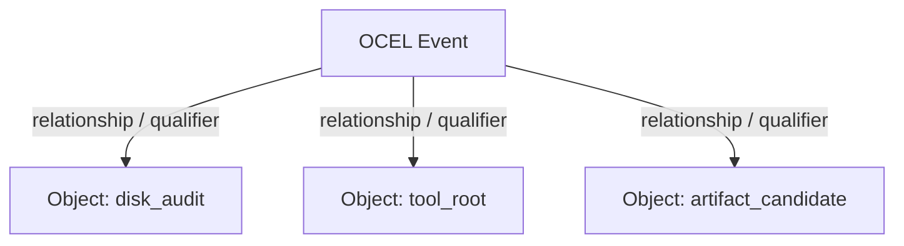

# OCEL v2 Reporting Model

`mac-artifact-cleaner` implements the **Object-Centric Event Log (OCEL v2)** standard to record system audits, cleanup plans, and execution receipts. Rather than unstructured text logs, OCEL v2 projects filesystem structures and mutations as a queryable event-object graph.

---

## 1. Why OCEL v2?

Traditional logging loses context: a line saying `Deleted folder /Users/user/target` doesn't capture the relationship between the deletion action, the plan that authorized it, the user who approved it, or the project context that produced it. 

OCEL v2 models these entities as **Objects** and mutations/observations as **Events**. This allows post-cleanup audits to ask complex questions:
*   *Which cleanup plan authorized the deletion of this specific file?*
*   *What was the size of the parent tool root when this deletion event occurred?*
*   *Were all deleted artifact candidates associated with a valid project root?*

---

## 2. The Log Structure

The core log schema is defined in [ocel.rs](file:///Users/sac/mac-artifact-cleaner/src/domain/ocel.rs). An OCEL log consists of:
1.  **Event Types & Object Types**: Schema definitions declaring attributes and their types (e.g., `string`, `integer`).
2.  **Objects**: Entities with unique IDs, types, and timed attributes.
3.  **Events**: Named transitions with timestamps, attributes, and relationships referencing objects.



---

## 3. Schema Definitions

### 3.1 Object Types

| Object Type | Description | Key Attributes |
|---|---|---|
| `disk_audit` | A single execution of the scanner. | `created_at` |
| `scan_root` | A requested directory traversal path. | `path` |
| `filesystem_object` | A file or directory observed on the disk. | `path`, `size`, `type` |
| `artifact_candidate` | A build/dependency artifact proposed for removal. | `path`, `category`, `bytes` |
| `tool_root` | Root package, cache, or model store (e.g., `.cargo`, `.npm`). | `path`, `category`, `bytes`, `files`, `dirs`, `recommendation` |
| `deletion_plan` | A serialized, reviewable cleanup plan. | `created_at`, `path` |
| `delete_attempt` | A specific filesystem remove command. | `path`, `status` |
| `delete_receipt` | The final record of a plan-bound delete execution run. | `completed_at`, `total_reclaimed_bytes` |
| `snapshot_state` | APFS snapshot or Time Machine volume status. | `snapshot_name`, `bytes_pinned` |
| `tm_exclusion_plan` | Generated script/plan to apply exclusions. | `script_path` |

### 3.2 Event Types

| Event Type | Meaning | Related Objects |
|---|---|---|
| `disk_audit_started` | The scan tool started traversing roots. | `disk_audit` |
| `scan_root_started` | Traversal of a specific `--root` began. | `scan_root`, `disk_audit` |
| `filesystem_object_observed` | A file/dir was walked and metadata collected. | `filesystem_object`, `disk_audit` |
| `traversal_barrier_applied` | A heavy directory (e.g. `node_modules`) was pruned from recursion. | `filesystem_object` |
| `bytes_attributed` | Storage blocks attributed to a specific project. | `filesystem_object`, `artifact_candidate` |
| `tool_root_observed` | An infrastructure tool directory was analyzed. | `tool_root`, `disk_audit` |
| `tool_root_review_proposed` | A tool root is stale/heavy and recommended for review. | `tool_root`, `disk_audit` |
| `artifact_candidate_proposed` | A rebuildable candidate was added to the potential cleanup list. | `artifact_candidate`, `disk_audit` |
| `deletion_plan_written` | A dry-run plan was saved to disk. | `deletion_plan`, `disk_audit` |
| `deletion_from_plan_started` | Plan-bound deletion execution commenced. | `deletion_plan`, `delete_receipt` |
| `artifact_deleted` | File/directory deleted successfully. | `artifact_candidate`, `delete_receipt` |
| `artifact_delete_skipped` | Deletion skipped because file/dir was already gone. | `artifact_candidate`, `delete_receipt` |
| `artifact_delete_refused` | Safe guard or permission block prevented deletion. | `artifact_candidate`, `delete_receipt` |
| `artifact_delete_failed` | System call error during deletion. | `artifact_candidate`, `delete_receipt` |
| `deletion_completed` | The plan-bound deletion execution finished. | `delete_receipt` |
| `snapshot_state_observed` | APFS/Time Machine snapshot footprint measured. | `snapshot_state`, `disk_audit` |
| `snapshot_thin_requested` | Command issued to thin/prune local snapshots. | `snapshot_state`, `delete_receipt` |
| `tm_exclusion_plan_written` | Time Machine exclusion script generated. | `tm_exclusion_plan`, `disk_audit` |

---

## 4. Required OCEL Relationships

To maintain auditing integrity, events must establish relationships with their causative objects using defined qualifiers:

*   **Delete Event Audit Trail**: Every `artifact_deleted` event must link to:
    *   The `delete_receipt` (qualifier: `receipt`)
    *   The `deletion_plan` (qualifier: `authorized-by`)
    *   The `artifact_candidate` (qualifier: `target-candidate`)
*   **Candidate Observation Trail**: Every `artifact_candidate_proposed` event must link to:
    *   The `disk_audit` (qualifier: `audit-run`)
    *   The corresponding `scan_root` (qualifier: `parent-root`)
*   **Tool Root Review**: Every `tool_root_review_proposed` event must link to:
    *   The `disk_audit` (qualifier: `audit-run`)
    *   The `tool_root` (qualifier: `review-target`)

---

## 5. JSON Representation Example

Below is a structurally correct representation of an emitted OCEL v2 log file matching the model output format:

```json
{
  "eventTypes": [
    {
      "name": "disk_audit_started",
      "attributes": [
        {"name": "tool", "type": "string"}
      ]
    },
    {
      "name": "tool_root_observed",
      "attributes": [
        {"name": "path", "type": "string"},
        {"name": "category", "type": "string"},
        {"name": "bytes", "type": "integer"}
      ]
    }
  ],
  "objectTypes": [
    {
      "name": "disk_audit",
      "attributes": [
        {"name": "created_at", "type": "string"}
      ]
    },
    {
      "name": "tool_root",
      "attributes": [
        {"name": "path", "type": "string"},
        {"name": "category", "type": "string"},
        {"name": "bytes", "type": "integer"}
      ]
    }
  ],
  "events": [
    {
      "id": "event-audit-started-1716768000",
      "type": "disk_audit_started",
      "time": "2026-05-26T14:00:00Z",
      "attributes": [
        {"name": "tool", "value": "mac-disk-auditor"}
      ],
      "relationships": [
        {"objectId": "audit-1716768000", "qualifier": "audit-run"}
      ]
    },
    {
      "id": "event-tool-root-observed-000001",
      "type": "tool_root_observed",
      "time": "2026-05-26T13:45:00Z",
      "attributes": [
        {"name": "path", "value": "/Users/<user>/.npm"},
        {"name": "category", "value": "node_package_cache"},
        {"name": "bytes", "value": 1420583920}
      ],
      "relationships": [
        {"objectId": "audit-1716768000", "qualifier": "audit-run"},
        {"objectId": "tool-root-_Users_<user>__npm", "qualifier": "observed-tool-root"}
      ]
    }
  ],
  "objects": [
    {
      "id": "audit-1716768000",
      "type": "disk_audit",
      "attributes": [
        {"name": "created_at", "time": "2026-05-26T14:00:00Z", "value": "2026-05-26T14:00:00Z"}
      ],
      "relationships": []
    },
    {
      "id": "tool-root-_Users_<user>__npm",
      "type": "tool_root",
      "attributes": [
        {"name": "path", "time": "2026-05-26T13:45:00Z", "value": "/Users/<user>/.npm"},
        {"name": "category", "time": "2026-05-26T13:45:00Z", "value": "node_package_cache"},
        {"name": "bytes", "time": "2026-05-26T13:45:00Z", "value": 1420583920}
      ],
      "relationships": [
        {"objectId": "audit-1716768000", "qualifier": "observed-in"}
      ]
    }
  ]
}
```

> [!TIP]
> Use standard JSON validators or OCEL parsers to inspect the emitted OCEL file structures. All domain transformations are strictly typed in Rust to prevent structural drift.
