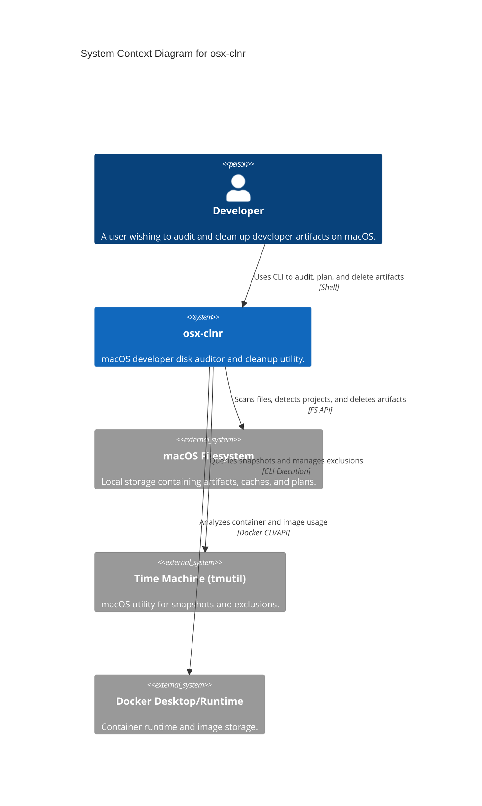
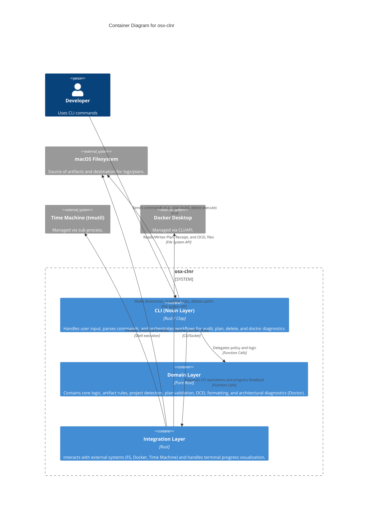

# osx-clnr Architecture

This document provides a comprehensive overview of the `osx-clnr` architecture using the C4 model.

## 1. System Context Diagram

The System Context diagram provides a high-level view of the `osx-clnr` and its relationship with the external environment.

## 2. Container Diagram

The Container diagram decomposes the system into its primary logical building blocks, showing how the layers interact.

## 3. Layer Descriptions

### CLI (Noun Layer)
The `nouns/` module follows a `clap-noun-verb` structure. It is responsible for:
- Parsing command-line arguments.
- Formatting output for the user.
- Coordinating high-level workflows (e.g., "Scan FS" -> "Apply Domain Rules" -> "Save Plan").
- Serializing/Deserializing state files (Plans, Receipts).
- **Doctor (G9):** Implementing diagnostics and plan-based self-healing workflows.

### Domain Layer
The `domain/` module contains the "brain" of the application. It is strictly side-effect-free (no direct I/O):
- **Artifacts (G0-G2):** Rules for identifying developer artifacts and traversal barriers.
- **Plan (G3):** Logic for building and validating deletion plans.
- **Audit (G4):** Inventory counting and statistics estimation.
- **Time Machine (G5):** Policies for snapshot management and exclusions.
- **OCEL (G7):** Implementation of Object-Centric Event Log v2 mapping.
- **Redaction (G8):** Privacy rules for sanitizing local paths (Auto-redaction gate).
- **Doctor (G9):** Architectural integrity and privacy verification logic.

### Integration Layer
The `integration/` module handles all interactions with the outside world:
- **FS Integration:** High-performance filesystem traversal using `WalkBuilder`.
- **TMUtil Integration:** Wrapper for the macOS `tmutil` CLI.
- **Docker Integration:** Logic to analyze containerized artifacts.
- **Progress:** Terminal UI components (progress bars, spinners) using `indicatif`.

## 4. Data Flow: Plan-Bound Deletion

One of the core design principles is that deletion is **plan-bound**.

1. **Audit/Plan Phase:**
   - `CLI` requests a scan from `Integration`.
   - `CLI` filters candidates through `Domain` rules.
   - `CLI` saves the resulting `DeletionPlan` (JSON) to the `Filesystem`.
2. **Review Phase:**
   - User inspects the Plan file manually or via `plan inspect`.
3. **Execution Phase:**
   - `CLI` loads the Plan from `Filesystem`.
   - `CLI` requests `Domain` to validate items against the plan.
   - `CLI` requests `Integration` to perform the actual deletion of validated items.
   - `CLI` saves a `DeletionReceipt` (OCEL) to the `Filesystem`.
