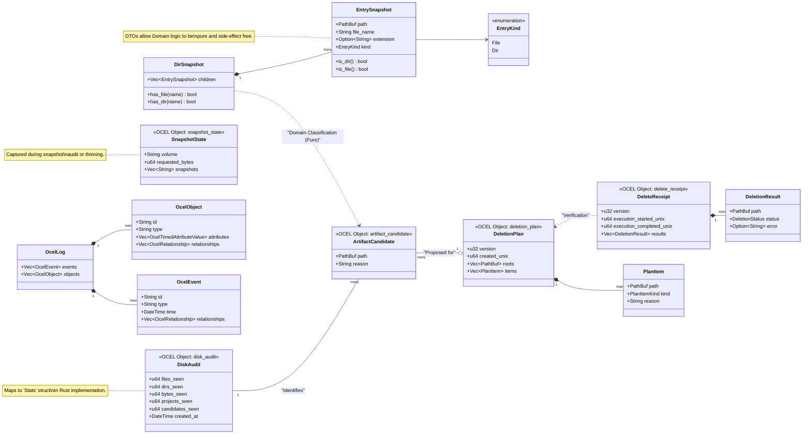

# Domain & OCEL v2 Class Diagram

This diagram illustrates the core entities of the `osx-clnr`, focusing on the **Inert DTOs** that isolate the Domain layer from side-effects and the **OCEL v2** objects that represent the system's audit and execution state.

## Implementation Mapping

| OCEL v2 Object | Rust Domain Struct | Location |
| :--- | :--- | :--- |
| `disk_audit` | `Stats` | `src/domain/audit.rs` |
| `artifact_candidate` | `Candidate` | `src/domain/artifact.rs` |
| `deletion_plan` | `DeletionPlan` | `src/domain/plan.rs` |
| `delete_receipt` | `DeletionReceipt` | `src/domain/receipt.rs` |
| `snapshot_state` | `SnapshotThinReceipt` | `src/domain/time.rs` |
| `N/A (DTO)` | `EntrySnapshot` | `src/domain/artifact.rs` |
| `N/A (DTO)` | `DirSnapshot` | `src/domain/artifact.rs` |

## Purity Boundary

The **Integration Layer** (in `src/integration/*.rs`) is responsible for all OS calls (e.g., `std::fs`, `tmutil`). It constructs inert **DTOs** (`EntrySnapshot`, `DirSnapshot`) and passes them into the **Domain Layer**. 

The Domain Layer functions are deterministic and side-effect free, returning classified **Candidates** or **Plans**. These are eventually exported as **OCEL v2** objects, providing a cryptographically verifiable audit trail of all "observations" and "decisions" made by the tool.
