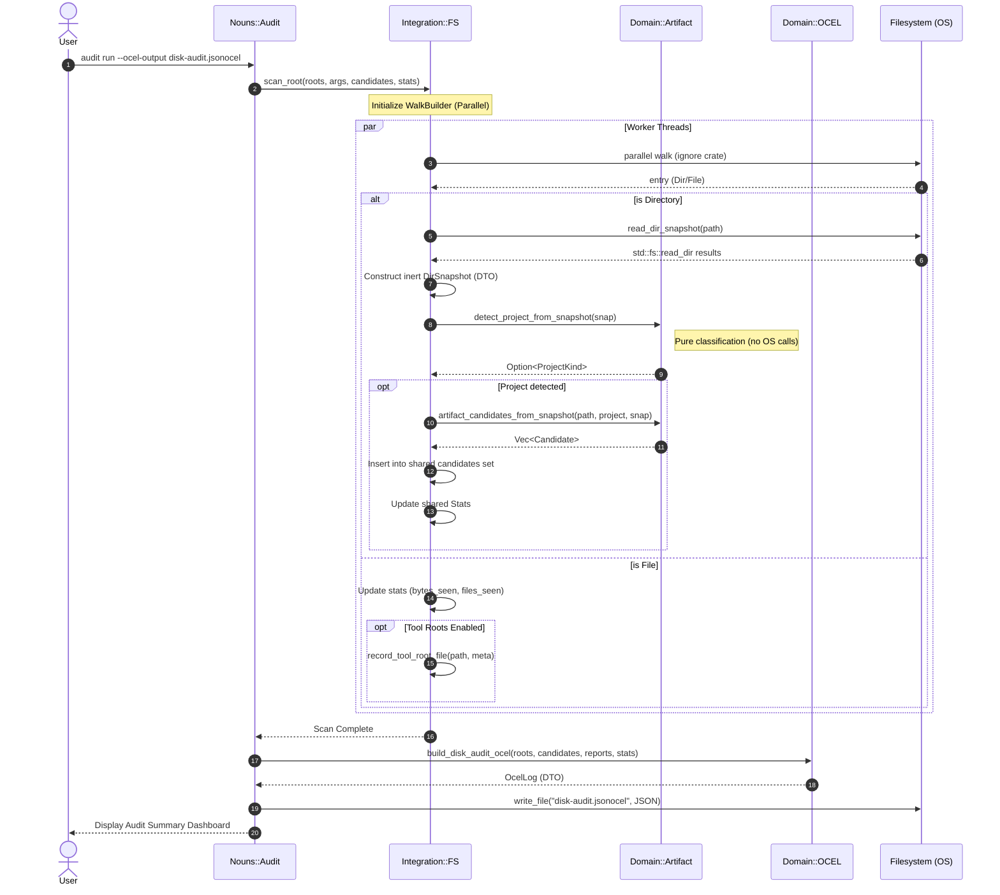
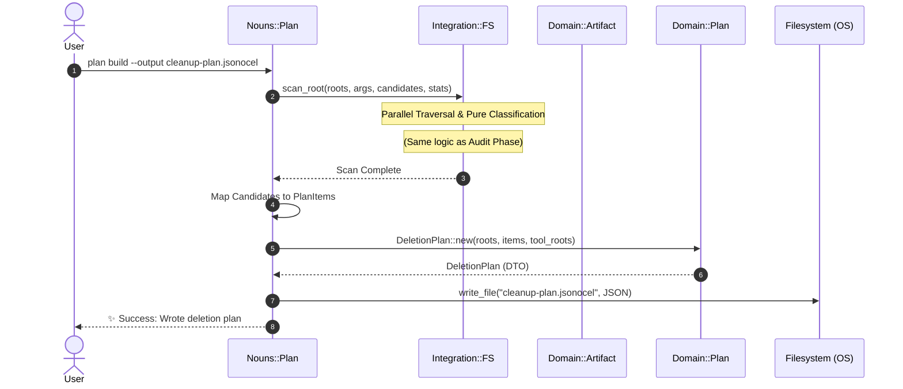

# mac-artifact-cleaner: Audit & Plan Sequence Diagrams

This document details the flow of the **Audit** and **Plan** phases, highlighting the interaction between the CLI Noun layer, the Integration layer's parallel traversal, and the pure Domain classification.

## 1. Audit Phase Sequence

The Audit phase performs a high-speed parallel scan of the filesystem to identify developer artifacts and tool-root caches. It produces a detailed report and an optional OCEL v2 event log.

## 2. Plan Phase Sequence

The Plan phase uses the same scanning engine as Audit but focuses on preparing a `DeletionPlan`. This plan serves as a safety barrier for subsequent deletion actions.

## Key Architectural Principles

1.  **Integration/Domain Separation**: The Integration layer (`src/integration/fs.rs`) is the only part of the scanner that touches the OS (`std::fs`). It converts live OS handles into inert Data Transfer Objects (DTOs) like `DirSnapshot`.
2.  **Pure Domain Classification**: The Domain layer (`src/domain/artifact.rs`) performs classification using only the DTOs. This makes the core logic testable without mocking the filesystem.
3.  **Parallel Execution**: The `ignore` crate's parallel walker is used to saturate CPU cores while traversing the macOS filesystem, with thread-safe aggregation via `Arc`, `Mutex`, and `DashMap`.
4.  **Artifact-Centric Observability**: The generation of `disk-audit.jsonocel` allows for external process mining and auditing of what was discovered on the disk.
