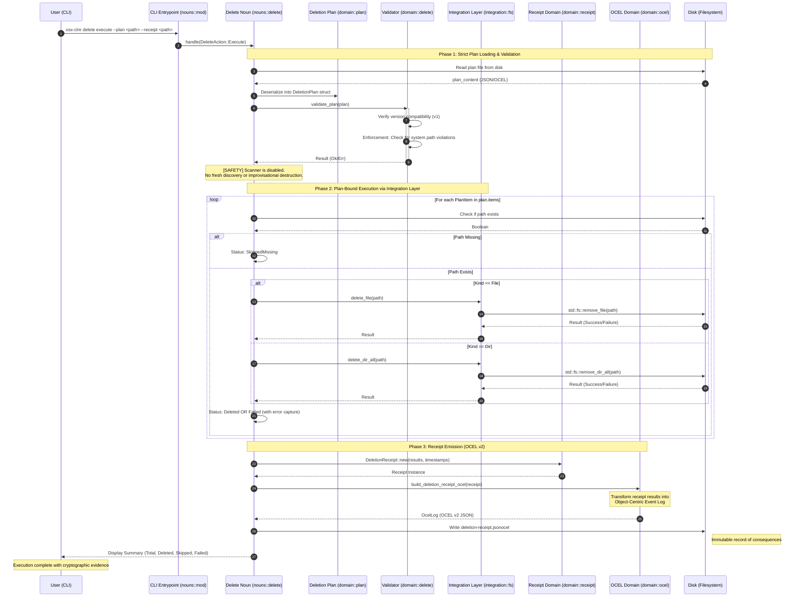

# Sequence Diagram: Delete and Receipt Phase

This diagram details the strict plan-bound execution of the `osx-clnr` delete phase, ensuring no destructive behavior occurs without a validated plan and that all consequences are recorded in an OCEL-compliant receipt.

## Key Constraints

1.  **Scanner Disabled**: The discovery logic (`integration::fs::scan_root`) is never invoked during the delete phase. Only the paths explicitly listed in the authorized plan are considered.
2.  **Validation Gate**: The `validate_plan` function acts as a safety barrier, preventing any system-critical paths from being included in the execution loop, even if they were accidentally included in the plan.
3.  **Integration Layer Decoupling**: Deletions are performed via `integration::fs` functions which wrap `std::fs`, ensuring a single point of entry for OS-level mutations.
4.  **OCEL Traceability**: Every deletion (or failure) is recorded as an event in the `deletion-receipt.jsonocel`, relating back to the plan and the original artifact candidate.
