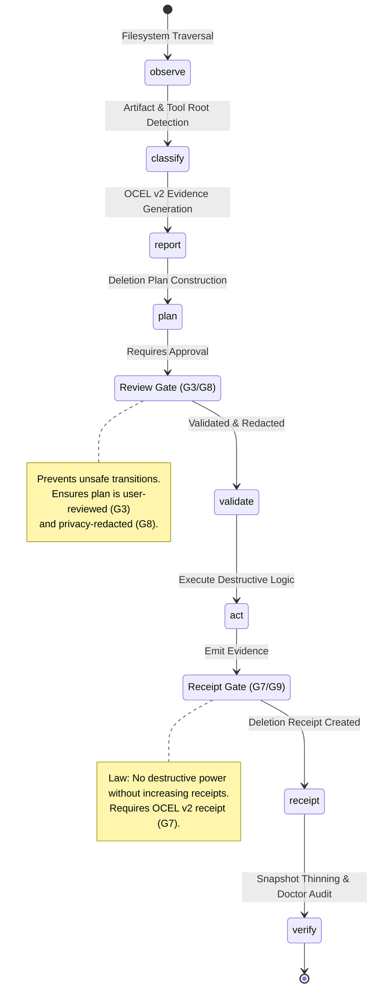

# Gall Checkpoint Execution Pipeline

This diagram illustrates the state machine for the `osx-clnr` execution pipeline, following Gall's Law: "Do not advance system complexity until the previous operational layer has produced evidence."

## Key Gates

### 1. Review Gate
Located between **Plan** and **Validate**, this gate prevents the scanner from deleting directly. The system must produce a `cleanup-plan.jsonocel` which must be validated for structural integrity and privacy (redaction) before the **Act** phase is permitted to read it.

The `review_gate --> validate` transition is an HMAC-signed approval, obtainable via either the MCP `plan(action: "approve")` tool or the CLI `oclnr plan approve` (both require `--yes`/`confirm: true`, and both refuse to approve a plan containing any Unknown/Irreversible-reversibility item without an explicit acknowledgement) — there is no separate state per entry path, both converge on the same signed-plan artifact before `validate`.

### Autoclean: unattended orchestration of the same pipeline
`oclnr autoclean run` (driven by the `com.oclnr.autoclean` launchd job installed via `oclnr daemon install-autoclean`) walks this same state machine end to end as subprocesses — `plan build` → `plan approve` → `delete execute` → `receipt verify` — with strictly tighter gating than an interactive run: a hard `--max-reclaim-gb` cap (default 50) that refuses rather than approves an oversized plan, and an unconditional skip (never an override) of any plan carrying an Unknown/Irreversible item. It does not add a new state to the diagram above — it is an automated caller of the existing `review_gate` and `receipt_gate` transitions, logged to `~/Library/Logs/oclnr/autoclean.log`.

### 2. Receipt Gate
Located between **Act** and **Receipt**, this gate enforces the core architectural law: "Never increase destructive power without simultaneously increasing receipts." No deletion or snapshot thinning is considered complete or valid without the emission of a verifiable `delete-receipt.jsonocel`.
